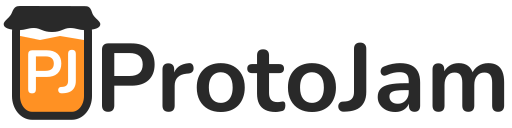

  

  An extensive library for game jams and rapid prototyping in <a href="https://godotengine.org/" target="_blank">Godot</a>

## Features

* :thread: Easy background resource loading
* :floppy_disk: Save data management
* :gear: Data-driven game settings
* :bookmark_tabs: Data-driven credit model
* :construction_worker: Commonly needed utilities
* :waning_crescent_moon: Scene swap and transition framework
* :feelsgood: Chainable health and damage framework
* :speaker: Global music manager
* :mouse: Easy mouse mode management
* :art: Prototyping material collection
* :brain: Node-based state machine
* :arrow_up_down: Item bob component

## Compatibility

Tested against Godot 4.6.

## Usage

Each class is extensively documented. Check their docs in the Godot IDE for more details.

## FAQ

Can I use this in a game jam?

This addon is quite large which may be against the rules for some jams. Always check with the jam organizers if you are unsure.

Can I use this in a commercial game?

Yes! ...but you shouldn't. This addon is optimized for rapid development. Performance is not a primary concern nor is full compatibility.

Can you add XYZ feature?

Possibly - search the [issues](/issues) and feel free to log a new request there if one hasn't already been made.

## Contributing

Contributions are always welcome! Check out the [contributing guide][contributing-guide] to get started.

## License

The code for this project is MIT licensed.

Resources for the example project in the [/resources folder](/resources) are licensed from [Kenney] under the Creative Commons Zero license.

Proudly made for humans, by humans [#NoAI][no-ai]

[contributing-guide]: .github/CONTRIBUTING.md
[no-ai]: https://itch.io/games/tag-no-ai
[kenney]: https://kenney.nl/
